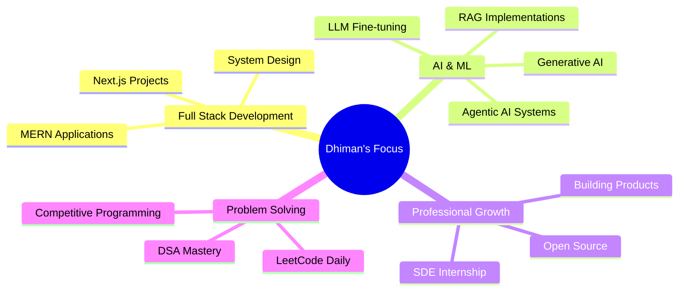

<div align="center">
  
  
  <h3>🚀 Full Stack Developer | Generative & Agentic AI | Problem Solver</h3>
  <h4>💼 SDE Intern @ Hummingbird Web Solutions</h4>
  
  <p>
    <a href="https://github.com/dhimanmajumdar">
      
    </a>
    <a href="https://github.com/dhimanmajumdar?tab=followers">
      
    </a>
    
  </p>
  
  <p>
    <a href="https://linkedin.com/in/dhiman-majumdar-09a3a423a">
      
    </a>
    <a href="mailto:dhimanmajumdar08233@gmail.com">
      
    </a>
    <a href="https://leetcode.com/dhimanmajumdar">
      
    </a>
  </p>
</div>

---

## 👨‍💻 About Me

```typescript
const dhiman = {
    currentRole: "SDE Intern @ Hummingbird Web Solutions",
    education: "B.Tech in Computer Science | PSIT Kanpur (2022-2026)",
    passion: ["Building AI Products", "Full Stack Development", "Data Engineering"],
    expertise: ["MERN Stack", "Next.js", "GenAI", "Agentic AI", "LLM Integration"],
    achievements: "600+ Problems Solved on LeetCode",
    hobbies: ["eFootball", "Watching Football", "Coding Challenges"],
    idol: "Cristiano Ronaldo ⚽",
    currentlyLearning: ["Advanced AI Architectures", "System Design", "Cloud Technologies"],
    funFact: "When I'm not debugging, I'm strategizing my next match in eFootball! 🎮"
};
```


## 🏆 GitHub Trophies

<div align="center">
  
</div>


## 🛠 Tech Stack

<div align="center">

### 💻 Frontend Development


### 🖥 Backend & Database


### 🤖 AI & Architecture


### ☁️ DevOps & Tools


</div>


## 📊 GitHub Statistics

<div align="center">
  
  
</div>

<div align="center">
  
  
</div>


## 📈 Contribution Graph

<div align="center">
  
</div>


## 💻 LeetCode Stats

<div align="center">
  
</div>

<div align="center">
  
  
</div>


## 🎯 Current Focus




> **Note:** Replace the repo names above with your actual repository names


## 🎵 Spotify Playing

<div align="center">
  
</div>


## 📫 Let's Connect

<div align="center">
  
  [](https://linkedin.com/in/dhiman-majumdar-09a3a423a)
  [](mailto:dhimanmajumdar08233@gmail.com)
  [](#)
  [](#)
  
</div>


## 💡 Quote of the Day

<div align="center">
  
</div>


## 🐍 Contribution Snake

<div align="center">
  <picture>
    <source media="(prefers-color-scheme: dark)" srcset="https://raw.githubusercontent.com/dhimanmajumdar/dhimanmajumdar/output/github-contribution-grid-snake-dark.svg">
    <source media="(prefers-color-scheme: light)" srcset="https://raw.githubusercontent.com/dhimanmajumdar/dhimanmajumdar/output/github-contribution-grid-snake.svg">
    
  </picture>
</div>

---

<div align="center">
  
</div>

<div align="center">
  
</div>
